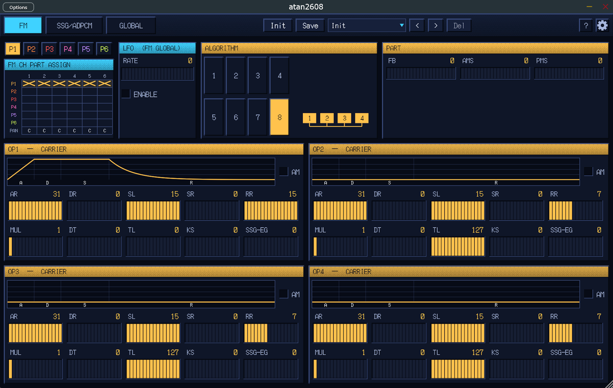

# atan2608 - YM2608 (OPNA) FM synthesizer

A multitimbral MIDI synth plugin built around the **Yamaha YM2608 "OPNA"** - the
sound chip of the NEC PC-9801-86 sound board. It wraps the
[ymfm](https://github.com/aaronsgiles/ymfm) `ym2608` core and exposes **all four
of the chip's sound sections at once**, each as an independent *part* you can
route to its own MIDI channel and/or key range:

- **6x FM** - 4-operator FM voices (the chip's main voice)
- **3x SSG** - square / noise PSG voices (the classic AY-3-8910 sound)
- **6x ADPCM-A** - rhythm/percussion sample drums (needs a rhythm ROM, see below)
- **1x ADPCM-B** - a PCM sampler you load your own audio into

Plus the chip's two "trick" modes that home-computer composers exploited:
**CH3 multi-frequency mode** (each of channel 3's four operators at its own
pitch) and **CSM** (Timer-A-driven formant synthesis for speech/choir tones).

Built with JUCE 8 (CMake + CPM, C++23). Builds a **Standalone** app, a **VST3**
plugin, and an **Audio Unit** (macOS only). Windows is the primary target.

---

## Quick start

1. Build (or grab a build) - see [Building](#building).
2. *(Optional)* Drop a YM2608 rhythm ROM in place if you want the drums - see
   [Rhythm ROM](#rhythm-rom). Everything else works without it.
3. Open the Standalone, pick a MIDI input, and play. The default patch is a
   simple 2-operator FM voice playing a 6-voice polyphonic part on **MIDI
   channel 1**.
4. Try the **Preset** menu (top toolbar) to hear the factory voices.

Out of the box the synth is set up for **tracker / DAW multitimbral use**: each
part listens on its own MIDI channel (see the [routing map](#default-midi-routing)),
so you can drive the whole chip from one multi-channel sequence.

---

## The interface



The toolbar across the top has the page tabs on the left, the **preset**
controls in the centre, and a **?** help toggle + a **⚙ settings** gear on the
right. Turn **?** on to get hover tooltips that explain each control (its
friendly name, what it does, and the underlying YM2608 register).

There are three pages:

- **FM** - everything for the FM voice: the **P1-P6** part tabs (and a **FM3 SP**
  tab when CH3-special is on), the **FM CH PART ASSIGN** matrix (which hardware
  channels belong to which part, + pan), the global **LFO**, the **ALGORITHM**
  picker, the part globals (**FB / AMS / PMS**), and the four operator cards
  (envelope plot + the operator parameters).
- **SSG/ADPCM** - the three non-FM parts: the **SAMPLER** (ADPCM-B), the **SSG**
  (with its per-channel A/B/C strip), and the **RHYTHM** drums (ADPCM-A).
- **GLOBAL** - the routing table (per-part MIDI channel / key range / octave /
  **solo** for every part), plus the per-patch chip controls: master **Output**,
  **Prescale**, and the **Limiter**.

### Presets

The **Preset** dropdown lists **Init** (reset to defaults), a **Factory**
submenu, then your saved user presets. `<<` / `>>` step through them. **Save**
writes the current state to your user bank; **Del** removes a user preset.

A **Rev** (revert) button appears next to the preset controls *only while the
patch differs from the loaded preset* - its presence is the "unsaved changes"
indicator, and clicking it reverts. **Init** (the button) resets every
parameter to its default.

Presets are full-state: a single preset captures every part, routing, and even a
loaded sampler sample, so loading one restores the whole instrument.

---

## Parts in detail

### FM (6 voices, organised into parts)

The chip has six 4-operator FM channels. Rather than one fixed 6-voice block,
they're grouped into up to **6 timbre parts** (P1-P6). Each part has its own full
patch (4 operators + algorithm/feedback/LFO depth), its own MIDI routing, and a
polyphony pool made of whichever hardware channels you assign to it.

On the **FM** page, the **FM CH PART ASSIGN** matrix assigns each of the six
hardware channels (CH1-CH6) to a part (or *off*) and sets its pan. **By default
all six channels belong to Part 1**, so you get a 6-voice polyphonic FM voice on
MIDI channel 1 - and Parts 2-6 exist but stay silent until you give them
channels. Want a 3-voice bass and a 3-voice lead? Put CH1-3 in Part 1 and CH4-6
in Part 2, then (on the **GLOBAL** page) route the two parts to different
channels or key ranges. (See the *Split Bass-Lead* factory preset.)

Each operator (OP1-OP4) has the standard OPN controls:

| Control | Range | What it does |
|---|---|---|
| **DT** Detune | 0-7 | Fine pitch offset (bit 2 = sign). |
| **MUL** Multiple | 0-15 | Frequency ratio vs. the played note. On a modulator this is the main timbre knob. |
| **TL** Total Level | 0-127 | Attenuation - **0 = loudest, 127 = silent**. Carrier = volume; modulator = FM depth. |
| **KS** Key Scale | 0-3 | Higher notes get shorter envelopes. |
| **AR** Attack | 0-31 | Attack rate (31 = instant). |
| **DR** Decay | 0-31 | First decay rate. |
| **SR** Sustain Rate | 0-31 | Second decay rate during sustain. |
| **SL** Sustain Level | 0-15 | Level where decay hands off to sustain. |
| **RR** Release | 0-15 | Release rate. |
| **SSG-EG** | 0-15 | Looping envelope modes (bit 3 = enable); advanced. |
| **AM** | off/on | This operator follows the LFO's amplitude modulation. |

Per part: **ALG** algorithm (0-7, the operator routing - 0 = serial chain, 7 =
all four additive, 4 = two parallel 2-op stacks), **FB** feedback (0-7,
self-modulation of OP1), and **AMS**/**PMS** (LFO amplitude/pitch mod depth). The
chip has **one global LFO** (rate + on/off) shared by every FM channel.

### FM CH3 Special (multi-frequency / CSM)

A gated pseudo-part that takes over physical channel 3 and gives **each of its
four operators an independent pitch** - something normal FM channels can't do.
Enable it by clicking the **CH3 column header** in the FM-page CH PART matrix;
that reveals the **FM3 SP** tab (its full editor) and the **FM CH3 SP** routing
row on the GLOBAL page. It's **monophonic** (authentic to the hardware) with
last-note priority, and every note re-attacks like a real chip retrigger.

- **Multi-frequency mode** (default): four operators, each with its own
  COARSE/CENTS detune and key-follow or fixed pitch - great for bell/cluster
  timbres.
- **CSM mode**: Timer A retriggers all four operators at the played-note rate,
  turning the operator pitches into fixed *formants* - the chip's speech/choir
  trick. The played note sets the fundamental; the operators set the vowel.

### SSG (square / noise)

Three PSG voices (A/B/C). Each channel is independently either:

- **Pooled** (default) - joins a shared polyphonic allocator using the common
  SSG timbre and the pooled SSG routing. All-pooled behaves like one 3-voice
  poly square/noise part.
- **Independent** - its own monophonic voice with its own mix/volume/envelope
  *and* its own MIDI channel / key range, so you can split (e.g.) a square bass
  and noise percussion across the keyboard, or layer several octaves on one
  channel. (See *SSG Octave Stack*.)

Controls: **MIX** (Tone / Noise / Tone+Noise / Off), **VOLUME** (0-15; the
default is 12), **HW ENV** (use the chip's hardware
envelope instead of a fixed level), plus the shared **noise period**, **envelope
period** and **envelope shape**. Note the hardware limits: there's a single
shared noise generator and a single shared envelope generator, so two channels
both using the HW envelope share its speed/shape (and re-triggering one re-arms
both - authentic cross-talk).

### Rhythm (ADPCM-A drums)

Six PCM percussion instruments from the rhythm ROM. **Higher level = louder**
(the opposite of FM's Total Level). Defaults to **MIDI channel 10** (General MIDI
drums). Per-instrument level + pan, and a master rhythm **TOTAL** level.

The chip only has six drums, so GM drum notes fold onto them:

| Instrument | MIDI notes |
|---|---|
| Bass Drum | 35, 36 |
| Snare | 38, 40 |
| Cymbal (top) | 49, 51, 52, 55, 57, 59 |
| Hi-Hat | 42, 44, 46 |
| Tom | 41, 43, 45, 47, 48, 50 |
| Rim / Clap | 37, 39 |

Notes outside this set don't trigger the rhythm part. Drums are one-shot
(note-offs are ignored). Requires a [rhythm ROM](#rhythm-rom) - silent without one.

### Sampler (ADPCM-B)

Load a **WAV / AIFF / FLAC** with the **Load Sample** button on the SSG/ADPCM
page - or just **drag-and-drop** an audio file onto the waveform display. The
audio is resampled to the chosen storage rate, encoded to ADPCM-B, and uploaded
to the chip's RAM. Playback is **monophonic** and pitched by MIDI note. The
hardware has **no amplitude envelope** - only a static level. The waveform shows
the Start/End window and a loop indicator.

| Control | Range | Notes |
|---|---|---|
| **Level** | 0-255 | Static playback level. |
| **Root Note** | 0-127 | MIDI note at which the sample plays at its original pitch. |
| **Pan** | L/C/R | Output panning. |
| **Rate** | 8 / 11 / 16 / 22 / 32 / 44 kHz | Storage rate. Lower rates widen the upward pitch range at the cost of treble. Default 16 kHz. |
| **Offset** | 0-1000 | For samples too long to fit in chip RAM, slides the captured window across the source file (0 = head, 1000 = tail). Applied at load. |
| **Start / End** | 0-1000 | Playback window (per-mille of the sample). |
| **Loop** | off/on | Loop between Start and End. |
| **Re-Enc** | off/on | See below. |

> **A note on Start and looping.** ADPCM-B is a *differential* codec, and the
> real chip resets its predictor at the start address (and at every loop point),
> so a non-zero **Start** normally plays *quiet* until the decoder re-converges -
> this is faithful hardware behaviour. Turn on **Re-Enc** to re-encode the sample
> with a fresh predictor reset at the start point, so a mid-sample start (and each
> loop) plays at full level instead.
>
> There is another end-of-region quirk: ADPCM-B addresses external RAM in
> **32-byte units** (64 decoded samples), and ymfm models the decoder's
> three-nibble look-ahead pipeline by withholding the final **three samples** of
> that addressed region. On repeat, the predictor/step reset and playback begins
> again at Start. A mathematically seamless source loop can therefore still click
> unless it is aligned to the chip's *effective* region rather than merely to the
> source endpoints. The factory **Sampler Saw** demonstrates the workaround: its
> waveform is phase-aligned across the samples the chip actually outputs, followed
> by three guard samples consumed by the end-of-region pipeline.

---

## Pitch bend & octave

- **Pitch bend** works on FM, CH3-special, SSG and the sampler, with a fixed
  **+/-2 semitone** range. Held notes bend live without re-triggering.
- Every melodic part has an **OCT** transpose (+/-4 octaves) on the GLOBAL page.
  It's a play-time transpose: a key-split point stays put, but accepted notes
  sound at the transposed pitch.

---

## Default MIDI routing

Each note is offered to **every part whose routing accepts it** (channel match +
key range), so parts can be **layered** (overlapping routing) or **split**
(different channels / key ranges). Channel **0 = Omni** (all channels).

The factory defaults assign each part a distinct channel for multitimbral use:

| Part | Default MIDI channel |
|---|---|
| FM Part 1 | 1 |
| FM Parts 2-6 | 2-6 *(no voices until you assign channels in the CH PART matrix)* |
| FM CH3 Special | 7 *(disabled by default)* |
| SSG (pooled) | 8 |
| Sampler | 9 |
| Rhythm | 10 |
| SSG A / B / C (independent) | 11 / 12 / 13 *(only when set to Independent)* |

The **Solo** switches (per part, on the GLOBAL page) are an audition aid: while
*any* part is soloed, only soloed parts sound.

---

## Factory presets

Reachable from **Preset -> Factory**:

| Preset | What it is |
|---|---|
| **Bright Brass** | Two-stack FM brass with a rounded attack and bright upper bite. |
| **Bell** | Inharmonic 2-op FM with a long metallic tail. |
| **Bass** | Punchy 2-op FM bass. |
| **Electric Piano** | Two-stack FM electric piano with a bright tine transient. |
| **Drawbar Organ** | Additive four-harmonic organ. |
| **Digital Pluck** | Bright four-operator attack over a quieter plucked body. |
| **Soft Strings** | Slow additive ensemble voice. |
| **FM Lead** | Focused, harmonically rich two-stack lead. |
| **Glass Keys** | Additive glass mallet with a shimmering decay. |
| **Arcade Layer** | FM body layered with a quiet SSG octave. |
| **SSG Init** | Plain pooled SSG tone on MIDI channel 1, ready for editing. |
| **SSG Tremolo Lead** | Pooled SSG lead animated by the shared hardware envelope. |
| **Split Bass-Lead** | Keyboard split: a 3-voice FM bass (low) + 3-voice FM lead (high). |
| **Stacked Pad** | Two detuned FM layers panned apart for width. |
| **SSG Octave Stack** | Three independent SSG tones layered at -1 / 0 / +1 octaves. |
| **Sampler Saw** | Looping embedded saw wave on MIDI channel 1, ready as a sampler starting point. |

---

## Global chip controls (GLOBAL page footer)

These travel **with the preset** (they're patch state), and live at the bottom of
the GLOBAL page:

- **Output** - master gain. The chip's single-carrier peak is low (~-18 dBFS),
  so this defaults to **4.0** to reach a usable level.
- **Prescale** - the chip's clock prescaler (**6** default / **3** = +1 octave
  of range / **2**). The note encoders compensate so pitch stays correct.
- **Limiter** - an opt-in soft-knee output peak limiter, to tame the loud spikes
  the chip can produce (notably the SSG hardware envelope).

## Settings (⚙ gear)

The gear opens a panel for **machine-local** preferences - these do *not* travel
inside saved presets:

- **Fidelity** - quality of the native-rate->host-rate resampling
  (Low / Medium / High).
- **Rhythm ROM** - load a ROM file (overrides the default location), or revert
  to the default location.
- **Reset Window Size** - restore the default editor size.

The build's version/commit is shown in the corner of the panel. The **?** help
toggle and the editor **window size** are also machine-local preferences.

---

## Rhythm ROM

The YM2608's ADPCM-A rhythm samples live in a small **8 KB ROM** that is
copyrighted Yamaha data, so it is **not bundled** with the plugin. The rhythm
part is the only thing that needs it; everything else works without one.

At startup the plugin auto-loads it from:

```
%APPDATA%/atan2608/ym2608_adpcm_rom.bin
```

Drop your own 8 KB dump there, or load one manually via **Settings -> Load ROM**
(which persists as an override). If no ROM is found, the rhythm part is simply
silent.

---

## Building

Windows / PowerShell:

```pwsh
cmake --preset default
cmake --build build --target AudioPlugin_Standalone --config Debug
# -> build/AudioPlugin_artefacts/Debug/Standalone/atan2608.exe
```

The VST3 builds from the `AudioPlugin_VST3` target. Tests:

```pwsh
cmake --build build --target AudioPluginTest --config Debug
build/test/Debug/AudioPluginTest.exe
```

See [CLAUDE.md](CLAUDE.md) for the architecture, the "part" pattern, and the
non-obvious YM2608 implementation notes.

---

## Credits & licensing

- FM/SSG/ADPCM emulation: **[ymfm](https://github.com/aaronsgiles/ymfm)** by
  Aaron Giles (the MAME `ymfm` variant, vendored in `deps/`).
- Plugin framework: **[JUCE](https://juce.com)** 8.
- The rhythm ROM is Yamaha-copyrighted and is **not** distributed with this
  project - you supply your own (see above).

This project is in active single-developer development; formats and parameters
may change without backward-compatibility shims.
